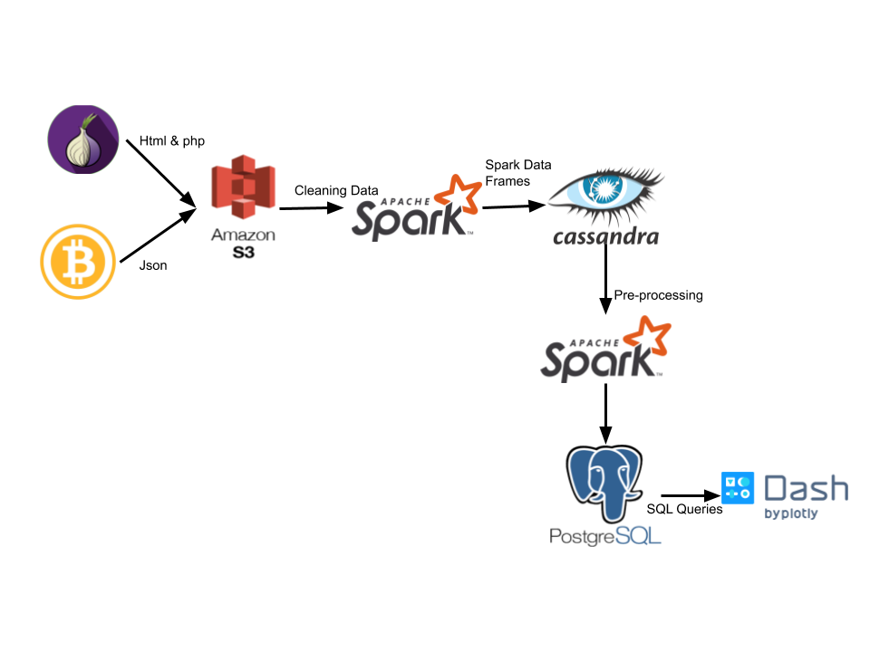

# DarkCoin

Bitcoin transaction tracker for Dark Web marketplaces

[Link](https://bit.ly/DarkCoinPresent) to your presentation.

## Introduction

The problem is the usage of Bitcoin for illegal transactions on Dark Web marketplaces because it is hard to trace back.

The goal of the project is to find and mark Bitcoin public keys that are possibly related to a Dark Web transactions and other public keys that are related to these “dirty” keys.

## Architecture

## Dataset

HTML files of Dark Web marketplaces scraped on 2014 and 2015, stored in a S3 bucket.

Data of Bitcoin blocks acquired from blockchain.com API by running multithreaded bash scripts on EC2 instance and stored in a S3 bucket.

## Engineering challenges

Getting data of each Bitcoin block with HTTP requests from the API is a very slow process. Used a multithreading approach to speed up process.

Creating schema and parser for each marketplace since they have different format and data.

## Trade-offs

## How to install and get it up and running

